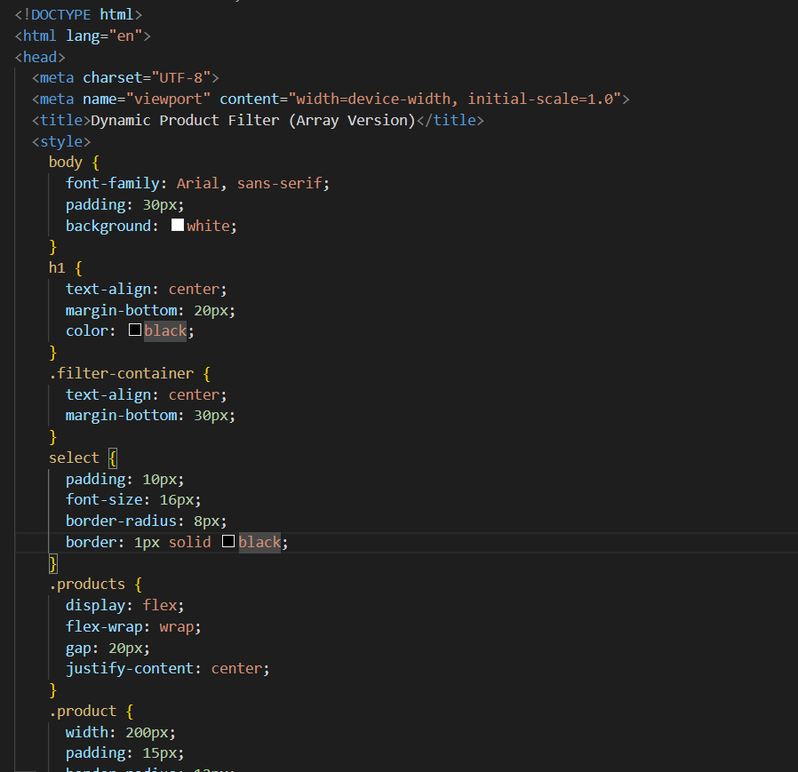
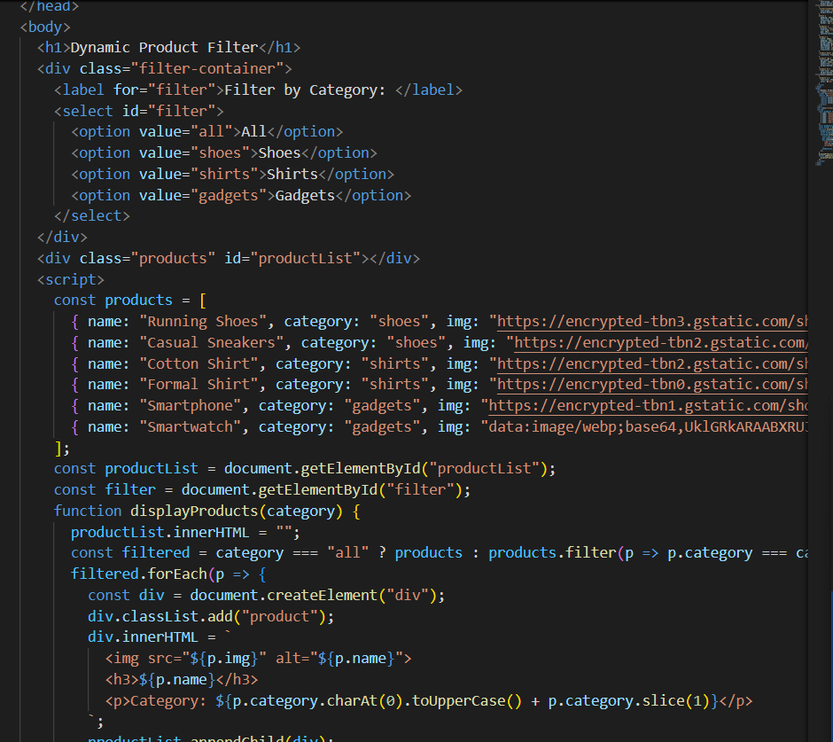
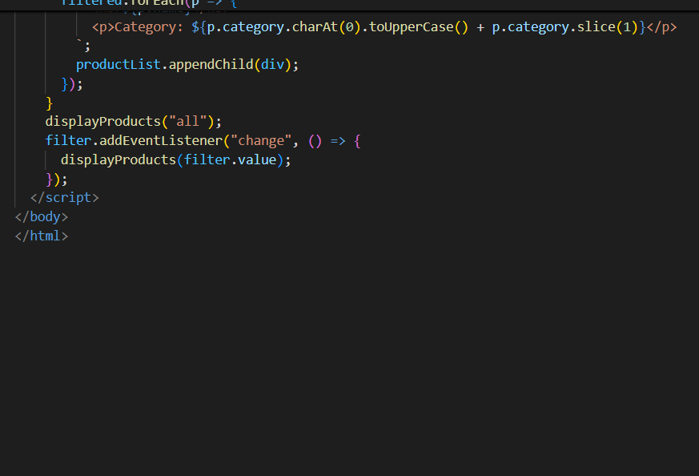
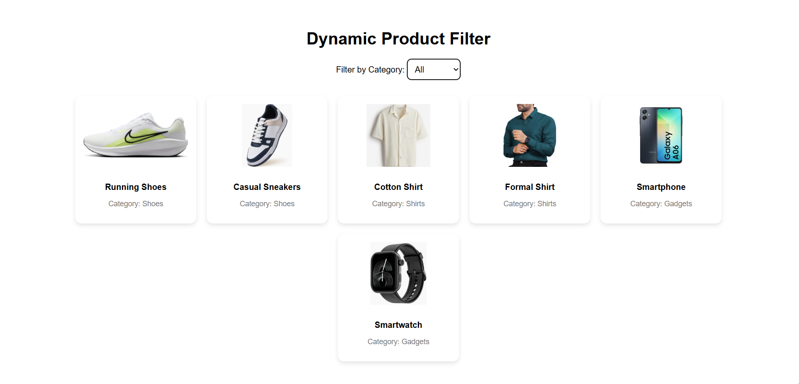
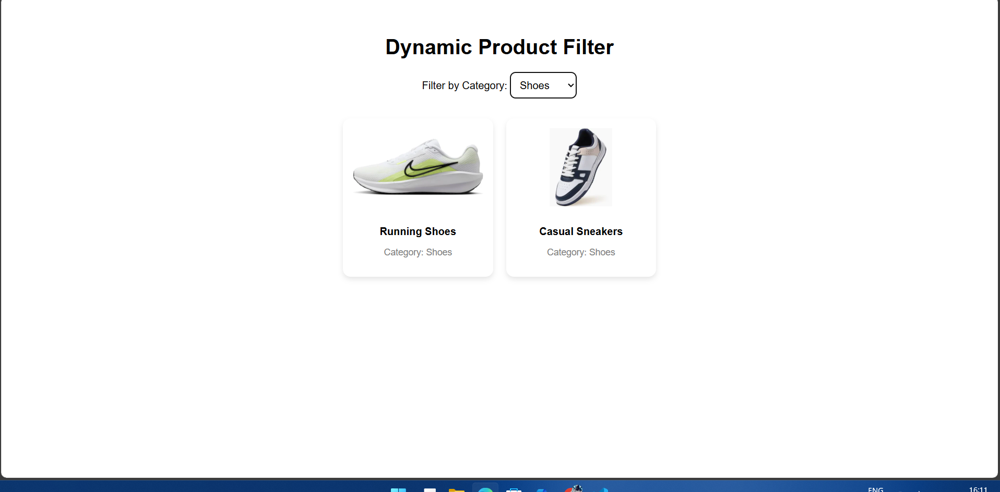
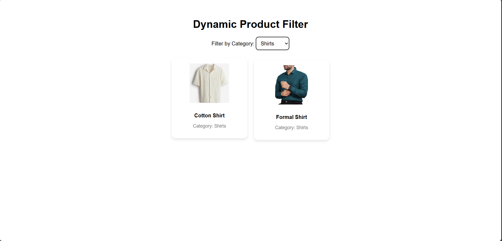
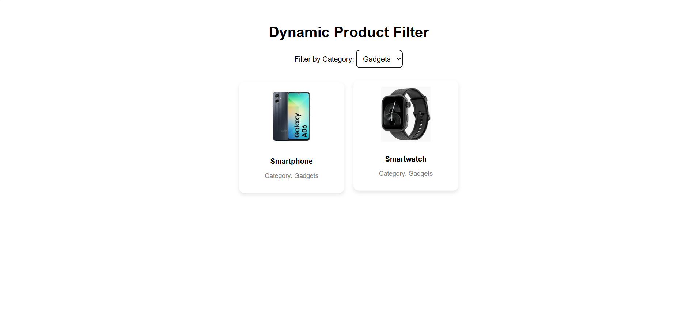

# Dynamic Product Filter with Dropdown using JavaScript DOM Manipulation

## Objective
Build a web-based product list that can dynamically filter and display items based on the user's selection from a dropdown menu. This task helps you understand how to use JavaScript to manipulate the DOM, handle events, and update visible elements in real time.

## Task Description
Create a web page that displays a list of products (for example, shoes, shirts, or gadgets). Above the product list, include a dropdown menu with filter options such as "All", "Category 1", "Category 2", etc. When the user selects an option from the dropdown, the product list should update immediately to show only the items that match the selected category. If "All" is selected, all products should be displayed. The filtering and display changes must happen dynamically using JavaScript without reloading the page.

## Aim
To practice real-time DOM manipulation in JavaScript by dynamically filtering and displaying products based on dropdown selection.

## Code Screenshot

## Output Screenshot

## Learning Outcomes
- Learned how to create and manipulate arrays of data in JavaScript.  
- Understood the use of event listeners for handling dropdown menu selections.  
- Gained experience in updating the DOM dynamically without reloading the page.  
- Practiced separating logic (data filtering) from presentation (HTML rendering).  
- Improved understanding of how to build interactive web pages.
